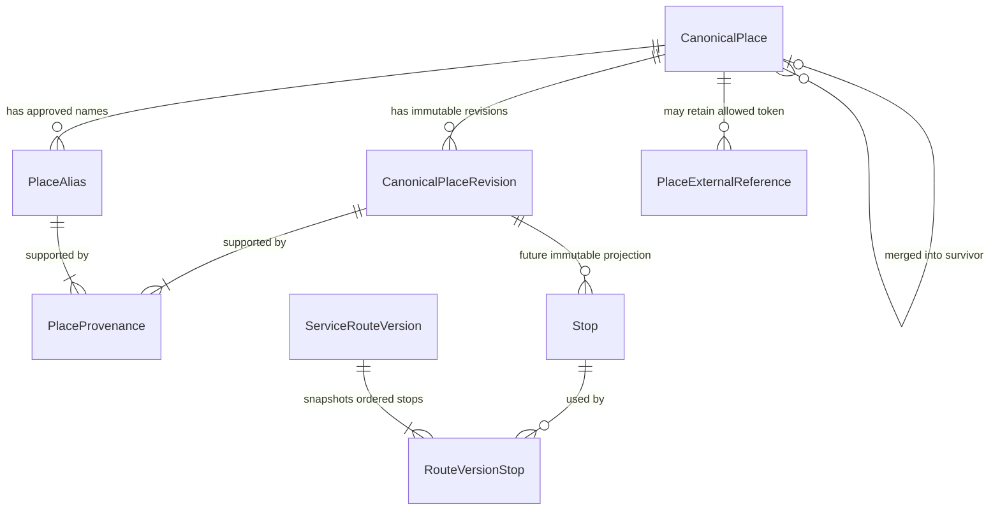

# Canonical Palestinian Place Catalog and Search Architecture

Status: `M7D1C_CANONICAL_PLACE_CATALOG_DESIGN=ACTIVE_DESIGN_ONLY`

This is a design artifact. It introduces no schema, migration, endpoint, UI, provider call, or production enablement.

## 1. Decision summary and evidence boundary

Masari's approved canonical place catalog, not a generic provider, is the authority for public places and transport stops. M7D1B's fixed acceptance gate was Arabic >=95%, English >=95%, and overall >=95%. Final overall/top-1 results were Nominatim 85.0%, Google Places Text Search 80.0%, Photon 75.0%, Pelias 41.7%, and Google Geocoding v4 35.0%. No generic provider passed, and M7D1C does not rerun those benchmarks.

The following decisions remain authoritative:

- `GENERIC_GEOCODER_AS_SOURCE_OF_TRUTH=NOT_APPROVED`
- `CANONICAL_PLACE_CATALOG_DIRECTION=APPROVED`
- `PROVIDER_SELECTION=NO_PROVIDER_APPROVED_YET`
- `GOOGLE_DISCOVERY_FALLBACK_CANDIDATE=CONDITIONAL`
- `GOOGLE_CANONICAL_PLACE_SOURCE=NOT_APPROVED`
- `GOOGLE_PLACES_STORAGE=RESTRICTED`
- `GOOGLE_PLACE_ID_STORAGE=PERMITTED_WITH_REFRESH_POLICY`
- `CANONICAL_ROUTE_STORAGE=LEGAL_REVIEW_REQUIRED`
- `ROUTE_MAPS_ENABLED=false`
- `ROUTE_PROVIDER=disabled`

## 2. What makes a place canonical

A place is canonical only when all of these conditions hold:

1. It represents a public, operationally relevant locality, institution, landmark, transport facility, or approved physical stop—not a private home or a person's location history.
2. An authorized Masari editor submitted a bounded bilingual identity and an allowed coordinate source.
3. A different authorized reviewer verified identity, locality, coordinates, precision, provenance, retention rights, and duplicate candidates.
4. An authorized approver who did not propose the searchable content approved an immutable revision and activated the stable place. The reviewer may also be the approver where staffing policy permits, but self-approval is never permitted.
5. The current revision and all searchable aliases remain active, approved, and audit-linked.

An external provider suggestion, operator draft, imported record, popular query, or coordinate alone is never canonical.

## 3. Controlled place taxonomy

The initial controlled taxonomy is intentionally compact:

| Type | Intended use |
| --- | --- |
| `LOCALITY` | City, town, or village used as geographic context. A later subtype may distinguish them only if operations require it. |
| `NEIGHBORHOOD` | Recognized district or neighborhood within a locality. |
| `TRANSPORT_HUB` | Bus station, terminal, shared-taxi hub, or interchange. |
| `EDUCATION` | University, college, or other operationally relevant educational institution. |
| `HEALTHCARE` | Hospital or operationally relevant public health facility. |
| `PUBLIC_FACILITY` | Government, civic, or public-service facility. |
| `LANDMARK` | Widely recognized public landmark useful for navigation. |
| `COMMERCIAL_CENTER` | Public market or major commercial center, not an individual merchant's private record. |
| `ROUTE_STOP` | A precise approved boarding/alighting point that is not better represented as a hub. |
| `OTHER` | Exceptional public place requiring reviewer justification. |

`PICKUP_POINT` and `DROPOFF_POINT` are route capabilities, not place types. `MERCHANT_LOCATION` and private addresses belong to separate privacy-sensitive domains. This avoids encoding temporary use into stable identity.

## 4. Conceptual data model



### `CanonicalPlace`

Stable identity only: internal ID, stable public key, current approved revision pointer, operational status (`inactive`, `active`, `deprecated`, `merged`), optional `merged_into_place_id`, creation actor/time, and update time. Human-readable slugs are not required for identity; whether the public key is opaque or curated needs human approval.

### `CanonicalPlaceRevision`

Immutable proposed/approved content: revision number; canonical Arabic and English names; derived normalized forms and normalization-algorithm version; type; locality/district/governorate context; latitude/longitude; coordinate precision class; coordinate verification time/actor; workflow status; submit/review/approval actors and timestamps; and creation time. Revision content is never edited after approval. A correction creates a new revision and deliberately advances the stable current pointer.

Locality, district, and governorate begin as references to canonical `LOCALITY`/`NEIGHBORHOOD` places where available, with a bounded administrative-area code only where the initial catalog cannot yet provide a parent. Free-form hierarchy strings must not become silent authorities.

### `PlaceAlias`

One immutable alias assertion contains place ID, language/script, display value, derived normalized value and algorithm version, alias type, bounded priority, workflow status, active/retired state, provenance, creation actor/time, approval actor/time, and retirement reason/time. Correcting an alias retires it and creates another row.

Alias types are `common`, `abbreviation`, `transliteration`, `legacy`, and `spelling_variant`. Canonical names are not duplicated as aliases. Uniqueness is enforced on `(place, language/script, normalization_version, normalized_value)`; catalog-wide collisions are allowed only as explicit ambiguity candidates and must never silently resolve across localities.

### `PlaceProvenance`

A field-level assertion supports a revision or alias. It records the field group (`identity`, `coordinate`, `alias`, or `administrative_context`), source class, bounded source reference, license/retention class, terms or dataset version where relevant, collected time, verifier, verification time, and legal-review state. It stores no secret or unrestricted raw provider response.

### `PlaceExternalReference`

An isolated provider reference contains place ID, provider, reference type, allowed opaque reference token, storage-policy version, collected/refreshed/expiry times, and active/retired state. It does not make provider names, coordinates, categories, or other content canonical. A provider token is never used as Masari's public place ID.

### Existing `Stop` and route entities

`Stop`, `RouteVersionStop`, and `ServiceRouteVersion` remain unchanged in M7D1C. A future migration may add a nullable link from a newly authored immutable `Stop` projection to the exact approved place revision. Existing stops receive no automatic mapping. This compatibility layer preserves the existing route invariants and avoids silently rewriting history.

## 5. Alias and language model

Aliases require an explicit language/script (`ar`, `en`, or approved Latin transliteration), normalized form, type, priority, verification state, provenance, and active state. Only approved active aliases affect normal search. A common local name may outrank a low-confidence transliteration, but never a canonical exact match.

For Palestine Polytechnic University, the Arabic canonical name could have separately approved Arabic common aliases, while `PPU`, `Palestine Polytechnic University`, and `Palestine Polytechnic` are separate approved English/abbreviation aliases. Similar text alone never creates or merges a place.

## 6. Deterministic normalization

Every indexed normalized value records a normalization algorithm version. A new algorithm is introduced by recomputing candidates under a new version, testing them, and deliberately promoting it; it never silently rewrites approved history.

### Arabic

The conservative `ar_v1` proposal:

1. Apply Unicode NFKC and reject invalid control characters.
2. Remove Arabic diacritics and tatweel.
3. Map Arabic-Indic and Eastern Arabic-Indic digits to ASCII digits.
4. Normalize `أ`, `إ`, `آ`, and `ٱ` to `ا`.
5. Normalize final `ى` to `ي`.
6. Treat approved punctuation/separators as spaces, then trim and collapse whitespace.
7. Preserve letter order and token order.

`ة` is **not** globally mapped to `ه`; reviewers add a spelling alias when both are genuinely used. The definite article `ال` is not stripped. Hamza inside other letters, roots, dialect spellings, synonyms, and locality names are not inferred. Mixed-script/confusable input is flagged, not silently rewritten.

Examples:

| Input | `ar_v1` normalized | Note |
| --- | --- | --- |
| `جَامِعَةُ  بوليتكنك فلسطين` | `جامعة بوليتكنك فلسطين` | Diacritics removed; `ة` is preserved. |
| `جامعــة القدس` | `جامعة القدس` | Tatweel removed. |
| `شارع ١٥` | `شارع 15` | Digits normalized. |
| `الجامعة` | `الجامعة` | Definite article retained. |

The first example explicitly demonstrates that `ة` is preserved. Normalization fixtures, not prose, become authoritative before implementation.

### English and Latin transliteration

The conservative `en_v1` proposal applies Unicode NFKC, locale-independent lowercase/case-folding, maps apostrophes and hyphens to token boundaries for normalized matching, removes other approved punctuation, and collapses whitespace. It does not infer synonyms, remove `al`, change token order, or equate transliterations.

`Al Khalil` and `Al-Khalil` normalize to the same token sequence. `Hebron` is equivalent only when approved as an alias. `Alkhaleel` remains a distinct value unless approved or returned as a lower-tier generated transliteration candidate.

## 7. Transliteration policy

Automatic transliteration may generate operator-visible suggestions and low-tier candidate recall. It cannot create an alias, satisfy identity verification, or make a record canonical. Generated candidates carry algorithm/version/confidence and never outrank approved canonical names or approved aliases.

Human-approved transliteration aliases such as `Al Khalil`, `Al-Khalil`, `Alkhaleel`, `Bethlehem`, `Beit Lahm`, or `Bayt Lahm` are explicit records with provenance. Search distinguishes an approved alias from a generated suggestion in both ranking and `matchReason`.

## 8. Canonical search pipeline

Normal search returns only active places with an approved current revision. The deterministic pipeline is:

1. Validate authorization/surface, query scalar length, Unicode, limit, type filters, and non-GPS context.
2. Preserve a display-safe query, compute versioned Arabic/English normalized forms, and detect script without guessing user identity.
3. Retrieve raw exact canonical-name candidates in the requested language.
4. Retrieve raw exact approved-alias candidates.
5. Retrieve normalized exact canonical and approved-alias candidates.
6. Before applying canonical-versus-alias tier priority, inspect the union of all exact candidates. If it contains multiple places, apply explicit locality/corridor context; otherwise return an ambiguity set rather than silently choosing.
7. Retrieve bounded canonical/alias prefix and all-token candidates.
8. Retrieve approved transliteration aliases, followed by generated transliteration candidates if that feature is approved.
9. Apply bounded fuzzy matching to the retrieved candidate set only.
10. Rank by a documented lexicographic tuple and stable place ID.
11. If canonical results are insufficient, offer a separate, explicit external-discovery action only on an authorized surface.

External results are never silently mixed into canonical results.

## 9. Deterministic ranking

Ranking uses a versioned lexicographic tuple instead of an opaque model:

1. match tier: raw canonical exact, raw alias exact, normalized canonical exact, normalized alias exact, canonical prefix, alias prefix, all-token, approved transliteration, generated transliteration, fuzzy;
2. active approved status (non-active content is excluded from ordinary search);
3. explicit locality/corridor/route-stop context match;
4. requested-language match;
5. bounded operational importance maintained by approved policy;
6. requested place-type match;
7. prefix coverage, token coverage, then fuzzy score;
8. approved alias priority;
9. stable public place key ascending.

Context cannot promote a fuzzy candidate above an unambiguous exact match. Importance cannot override identity quality. All factors and tie-breakers are returned in test-only diagnostics; public `matchReason` is a safe bounded category.

## 10. Location context without GPS

Allowed context is selected city/locality, known origin/destination locality, selected canonical corridor, route identity, or nearby canonical route stops. It consists only of canonical IDs and allowlisted types. M7D1C does not consume live GPS, user traces, raw coordinates, or inferred home/work locations.

For `الجامعة` with Hebron selected, verified Hebron institutions may rank above institutions in other localities. Without sufficient context, duplicate exact aliases across cities return an ambiguity list labeled by locality.

## 11. Fuzzy search and beta infrastructure

MySQL indexed equality/prefix retrieval is the beta foundation. Bounded application-side ranking may use token overlap, Unicode-aware Damerau-Levenshtein distance, and trigram similarity over no more than a configured candidate ceiling. Short queries receive stricter edit thresholds; one- and two-character fuzzy search is disabled. Cross-script fuzzy matching is disabled unless mediated by an approved transliteration alias/candidate.

Initial thresholds are intentionally undecided until the version-controlled fixture corpus is approved. A dedicated search engine is not justified before measured corpus size, p95 latency, or ranking requirements exceed this bounded design.

## 12. Duplicate detection and merge

Draft creation computes duplicate candidates from normalized canonical names, approved aliases, locality, type, and coordinate proximity. Proximity is a signal, never proof; thresholds vary by precision/type and cannot auto-merge. Exact normalized collisions across different localities remain legitimate ambiguity candidates.

A future merge operation must be transactional and dual-controlled:

1. lock source and survivor stable places;
2. require an approved merge rationale and provenance comparison;
3. reject cycles and merging into deprecated/merged targets;
4. migrate non-conflicting approved aliases and external references with provenance intact;
5. surface conflicting aliases for explicit review;
6. mark the source `merged`, set its survivor redirect, and retain all revisions/audit history;
7. leave historical stops, route versions, and trips unchanged;
8. require new route drafts/stops to use the survivor's approved current revision.

Deprecated places remain resolvable for history but are excluded from new ordinary search. Merged public IDs resolve to the survivor with a bounded redirect reason.

## 13. Coordinate and provenance policy

Every canonical coordinate requires latitude/longitude, precision class (`surveyed_point`, `entrance`, `facility_centroid`, `approximate_area`, or another approved bounded class), source class, license/retention class, source reference, collected time, verifier, and verification time. Approximate coordinates must be labeled and cannot masquerade as boarding-point precision.

Allowed source classes are:

- `MASARI_SURVEYED`: documented field verification under Masari procedure;
- `ORGANIZATION_PROVIDED`: supplied by the responsible public organization with retainable permission;
- `OPERATOR_VERIFIED`: independently checked by trained operators against an approved retainable source/process;
- `COMPATIBLE_OPEN_DATA`: dataset whose license, attribution, and redistribution use are approved;
- `OSM_DERIVED`: quarantined as `LEGAL_REVIEW_REQUIRED` until the exact derivation/use is approved;
- `EXTERNAL_DISCOVERY_RESTRICTED`: ephemeral discovery only and not eligible as a canonical coordinate.

User submissions are untrusted duplicate/discovery leads, not canonical coordinate sources. Google or other commercial coordinates must not be copied merely because they were returned by search. Coordinate changes require a new immutable revision, a new verification decision, and downstream route review.

## 14. OSM/ODbL boundary

OSM-derived place names, coordinates, or systematic extracts may create database, attribution, share-alike, derivation, and distribution questions. The exact ingestion process, combination with Masari-owned records, offline distribution, attribution surface, and produced-database obligations require qualified review. Classification: `LEGAL_REVIEW_REQUIRED`.

This design gives no legal advice and does not resolve `CANONICAL_ROUTE_STORAGE=LEGAL_REVIEW_REQUIRED`.

## 15. External discovery contract

A future server-only provider-neutral concept is:

```text
searchExternalPlace(query, context, providerPolicy) -> EphemeralDiscoverySuggestion[]
```

Each suggestion is short-lived and contains only policy-allowed fields: provider category, opaque session-scoped suggestion ID, safe display label if display is permitted, coarse context if permitted, provider attribution, expiry, and supported next action. Raw responses, unrestricted coordinates, provider URLs, and hidden metadata are excluded.

Canonicalization is a separate admin operation that requires independently retainable evidence. An operator may not transcribe or re-key a restricted provider label, category, address, or coordinate to evade its storage policy. No suggestion has `placeId`, canonical status, or an automatic save action.

### Google boundary

Google remains `CONDITIONAL` for optional discovery. `GOOGLE_CANONICAL_PLACE_SOURCE=NOT_APPROVED` and Google content storage is restricted. A Google Place ID may be stored only in `PlaceExternalReference` after approval of a refresh/expiry policy and terms version. The token provides reconciliation to Google; it does not authorize retention of returned name, category, address, or coordinate as Masari-owned data.

## 16. Verification and admin workflow

Workflow state is separated from operational state:

- revision/alias workflow: `draft -> in_review -> approved` or `rejected`;
- stable-place operation: `inactive -> active -> deprecated` or `merged`.

This avoids redundant `verified` and `approved` states. Approval records the completed verification checklist; activation controls search availability.

Future capabilities are distinct even if beta staffing initially assigns them to a small number of admins:

- `place_editor`: create a stable draft, propose revisions/aliases, attach allowed provenance;
- `place_reviewer`: inspect bilingual identity, coordinate precision/source, duplicate candidates, and search preview;
- `place_approver`: approve/reject and activate; cannot approve content they proposed. Coordinate introduction/change, merge, and deprecation always require second-person approval;
- `place_auditor`: read revisions, provenance, decisions, and search diagnostics without mutation.

Admin operations include create, edit-by-new-revision, alias add/retire, coordinate verification, provenance review, approve/reject, activate, duplicate review/merge, deprecate, revision history, and deterministic search preview. There is no destructive delete or provider-result-to-canonical shortcut.

## 17. Audit and revision model

The existing `AuditEvent` infrastructure can conceptually carry bounded categorical place events, but a future migration must extend its action vocabulary deliberately. Audit events cover stable-place creation, revision submission/review/approval/rejection/activation, alias add/retire, coordinate verification, external-reference refresh/retire, merge, redirect, and deprecation.

Metadata contains IDs, revision numbers, actor/capability, policy versions, categorical outcomes, and reason codes—not raw provider payloads, credentials, private addresses, or unrestricted coordinates. Immutable `CanonicalPlaceRevision` and alias/provenance rows provide reconstructable content history; audit alone is not the content store.

## 18. Route integration and historical safety

Future route authoring should select an active approved `CanonicalPlaceRevision`, then create or reuse an immutable `Stop` projection carrying the exact bilingual names and coordinates needed by that route. The stop records its source place revision. Existing `RouteVersionStop` continues to reference that immutable `Stop`.

- Route stops therefore relate to a canonical place through an exact approved revision, not merely the mutable current place pointer.
- Route versions continue to snapshot names, stop order, permissions, and coordinates through immutable stops.
- A canonical place coordinate/name change creates a new place revision and does not mutate any existing stop or published route.
- Adopting a correction requires a new route draft/version and normal route review/publication.
- Historical trips remain preserved by their exact route-version references and existing bounded route snapshots.
- A merged/deprecated place does not rewrite historical routes. New route authoring follows the survivor/current active revision; affected current routes are flagged for deliberate replacement, not automatically edited.

## 19. Future search API concept

An authenticated versioned concept may eventually expose `GET /api/v1/places/search` with bounded inputs:

- `q` (required, 1–100 Unicode scalar values after trimming);
- `language` (`ar` or `en`);
- `locality_id`, `route_id`, or `corridor_id` as mutually bounded canonical context;
- allowlisted `type` values;
- `limit` from 1 to 20.

Normal output contains stable `placeId`, primary/secondary approved names, locality summary, type, operational availability, and safe `matchReason`. Raw coordinates are omitted from ordinary typeahead; an authorized route-authoring detail contract may return approved public coordinates only after license/privacy review. No private location, provenance internals, provider token, raw ranking score, or unrestricted label is returned.

External discovery, creation, approval, merge, and revision history use separate privileged contracts. None is implemented here.

## 20. Mobile experience concept

Passenger, driver, and merchant surfaces use Arabic-default typeahead over active canonical places, with English optional. Results show bilingual identity and locality to disambiguate. Route-aware/common-place suggestions are server-owned and deterministic. Ordinary users cannot enter raw latitude/longitude or promote external suggestions.

Recent canonical places, if later approved, store only stable canonical IDs with bounded retention in the user's private preference domain. Merchant private premises and user pickup/drop-off coordinates remain separate and never populate the public catalog automatically.

## 21. Offline and low-connectivity search

A limited Phase A catalog may be cached only if every included field is Masari-owned or explicitly licensed for that distribution. A signed/versioned manifest carries catalog version, normalization/ranking version, generated time, expiry/staleness policy, and checksum. Updates are full snapshots initially; deltas require atomic verification and fallback to the last valid snapshot.

Offline search supports exact, approved alias, normalized, prefix, and bounded token matching. It does not call external discovery, approve data, merge records, or persist provider content. When stale beyond the approved grace period, the client labels results as stale and blocks operations that require current active status while still allowing safe display of already-referenced historical names. Catalog cache contains no private address, query history, GPS, or user identity.

## 22. Performance and quality targets

Targets apply to an approved versioned acceptance corpus and beta-scale catalog:

- Arabic top-1 >=95%, English top-1 >=95%, and overall top-1 >=95% for unambiguous expected queries;
- 100% resolution of active exact canonical names and approved unambiguous aliases;
- 100% of ambiguous exact collisions return the approved ambiguity set unless explicit context resolves them;
- zero silent cross-locality false exact selections;
- deterministic identical ordering for identical catalog/query/context/algorithm versions;
- server-side search p95 <=200 ms and p99 <=400 ms under the approved beta load profile, excluding client/network latency;
- result limit <=20, query <=100 Unicode scalar values, and fuzzy candidate set bounded by configuration;
- external discovery latency and quality reported separately and never used to satisfy canonical quality.

## 23. Acceptance-test strategy

Version-controlled fixtures are small, reviewable, and expanded with the catalog. Each case records fixture version, query, language/script, context IDs, expected place ID(s), expected top-1 or ambiguity behavior, allowed match tier, and rationale/provenance reference. The initial Phase A suite includes:

- every active canonical Arabic and English name;
- every approved active alias and abbreviation;
- approved Palestinian transliterations and spelling variants;
- representative bounded typos by query length;
- universities, transport hubs, landmarks, neighborhoods, and locality names;
- duplicate names across localities and context/no-context cases;
- adversarial Unicode, punctuation, digit, mixed-script, and confusable cases;
- merged/deprecated exclusions and redirects;
- coordinate-free search assertions and external/canonical separation.

The corpus is split into approved regression cases and a held-out adjudication set maintained by reviewers. Top-1 gates use only unambiguous cases; ambiguity cases require the exact expected set and ordering. Failures cannot be waived by top-5 diagnostics. Test reports publish category/language totals without private queries or provider content.

## 24. Security controls

- Require authenticated, capability-scoped admin operations and distinct approval for high-risk changes.
- Validate optimistic revision/current-pointer state and use transactions for approval, activation, merge, and redirects.
- Sanitize labels at output, rely on framework escaping, reject control characters, and test stored-XSS payloads.
- Apply NFKC, script/confusable diagnostics, bounded lengths/token counts, and review warnings without destructive normalization.
- Rate-limit search and admin mutations separately; cap result/fuzzy candidate counts and execution time.
- Treat aliases, coordinates, provenance, imports, and external suggestions as untrusted until approved.
- Never accept provider, URL, credential, raw coordinate, source license, verification actor, or approval status from ordinary-user input.
- Record bounded audit events and alert on unusual bulk changes, repeated rejected aliases, coordinate jumps, and approval bypass attempts.
- Protect external reference tokens as restricted metadata and exclude them from normal search responses/logs.

## 25. Privacy model

The catalog is `PUBLIC_CANONICAL_PLACE` data only. It excludes private homes, ad-hoc pickup/drop-off coordinates, saved personal places, live GPS, device location, route traces, and location history. Those require separate purpose limitation, access control, retention, deletion, consent, and threat modeling.

A public business or institution is not automatically eligible: operational relevance, provenance, and approval are still required. User queries and recent selections are private telemetry/preferences and are not catalog provenance.

## 26. Progressive rollout and future migration plan

### Phase A: Hebron–Bethlehem corridor

Approve the taxonomy, policies, named reviewer capabilities, a curated corridor catalog, parent localities, aliases, coordinate evidence, and deterministic fixtures. Run shadow search against operator expectations before any user exposure.

### Phase B: major West Bank cities

Expand only after Phase A quality, ambiguity, latency, audit, backup/restore, and curation-SLA gates pass. Add locality-specific reviewers and collision fixtures.

### Phase C: broader Palestine where operationally supported

Expand by evidence and operations, not a coverage claim. Gaza, Jerusalem, and other regions require explicit data, legal, operational, and product review appropriate to actual service support.

### Future migration sequence (not M7D1C)

1. Approve ADR/design, source policies, capabilities, fixture format, and initial catalog.
2. Author a separate additive schema/migration proposal; do not use `db push` and do not alter historical migrations.
3. Introduce new nullable catalog tables/links with production search and route adoption disabled.
4. Seed only reviewed Phase A drafts with provenance; no provider-response bulk import.
5. Review/approve revisions and aliases; run duplicate and acceptance suites.
6. Map existing stops manually to exact approved revisions where justified; preserve unmapped stops and all route history.
7. Shadow canonical search and compare deterministic reports.
8. Enable operator search, then limited user search through separate reviewed gates.
9. Roll back enablement by disabling reads and restoring the prior current catalog pointer; additive rows/history remain non-destructively available for correction.

No migration 19 is created in M7D1C.

## 27. Explicit review-question answers

**Q1. What makes a place canonical?** An approved immutable revision, allowed public scope, complete provenance, duplicate review, and active stable identity.

**Q2. Who may create/approve one?** A capability-scoped editor creates; an authorized reviewer/approver verifies and approves. High-risk changes require a different actor.

**Q3. What source may provide coordinates?** Masari survey, authorized organization, trained verification, or approved compatible open data. OSM use is legal-review gated; restricted commercial discovery is not canonical evidence.

**Q4. How are aliases normalized?** With language/script-specific, conservative, versioned deterministic rules; normalization never itself asserts equivalence.

**Q5. How are Arabic and English ranked?** Exact canonical/approved alias tiers first, requested language and explicit locality context next, with deterministic quality and stable tie-breakers.

**Q6. How is transliteration handled?** Human-approved transliterations are aliases; generated transliterations are lower-tier suggestions only.

**Q7. How are duplicate places merged?** Dual-controlled transactional redirect to a survivor, non-conflicting alias/reference migration, conflict review, no deletion, and full audit/history retention.

**Q8. What happens to routes using a merged/deprecated place?** Historical stops/routes/trips remain unchanged. New authoring uses the survivor/current revision; current routes require deliberate new versions.

**Q9. What third-party data may be persisted?** Only fields explicitly permitted by reviewed terms/policy. A provider reference such as a Google Place ID may be isolated under an approved refresh policy; provider content is not presumed retainable.

**Q10. What can work offline?** A signed/versioned subset of Masari-owned or distribution-approved canonical names, aliases, context, types, and search indexes—never provider discovery or private location data.

**Q11. How is >=95% quality tested?** A versioned deterministic bilingual corpus with exact expected top-1 IDs or ambiguity sets, category/language reporting, held-out adjudication, and no top-5 substitution.

**Q12. What blocks implementation?** Human/independent design approval, legal/source policy, reviewer capabilities, approved Phase A data/fixtures, security/privacy review, schema/migration approval, and production/search rollout gates.

## 28. Independent design review findings

The design was reviewed against commercial-content leakage, private-place contamination, historical mutation, alias ambiguity, provenance, approval bypass, deterministic ranking, and operational boundaries.

### Critical

- None open. The initial risk that external suggestions could become canonical was resolved by a separate ephemeral contract, no automatic write path, and independently retainable provenance requirements.
- None open. Private homes, saved locations, GPS, and location history are explicitly excluded from `PUBLIC_CANONICAL_PLACE`.

### High

- None open. Historical route mutation is prevented by immutable place revisions, immutable stop projections, and new route versions for corrections.
- None open. The union of exact canonical and alias candidates is collision-checked before tier priority; cross-locality collisions return ambiguity unless explicit context resolves them, and global normalized uniqueness is not assumed.
- None open. Coordinate/provenance spoofing and approval bypass are addressed by field-level provenance, capability separation, dual control for high-risk changes, and transactional audit requirements.

### Medium

- Open: OSM/ODbL place-data ingestion and offline distribution remain `LEGAL_REVIEW_REQUIRED`.
- Open: exact fuzzy thresholds and alias collision constraints require the approved Phase A corpus.
- Open: named operational owners, reviewer capabilities, and curation service levels require human assignment.
- Open: external-reference retention/refresh policies require provider-specific legal and security approval.

### Low

- Open: choose opaque public keys versus curated slugs.
- Open: determine whether `LOCALITY` needs city/town/village subtypes after Phase A usage evidence.
- Open: choose and version any generated transliteration algorithm before allowing it into candidate recall.

## 29. Implementation blockers and human decisions

Implementation blockers are: design/ADR approval; legal approval for each source/retention/distribution path; approved coordinate-verification procedure; assigned editor/reviewer/approver capabilities; approved Phase A catalog and fixtures; schema/migration review; security/privacy threat review; backup/restore and audit design; and rollout/rollback approval.

Human approval is specifically required for the taxonomy, public ID form, source/license matrix, OSM boundary, coordinate precision policy, dual-control staffing, normalization versions, fuzzy thresholds, initial fixture adjudication, offline distribution scope, external reference policy, and any future schema or production gate.
